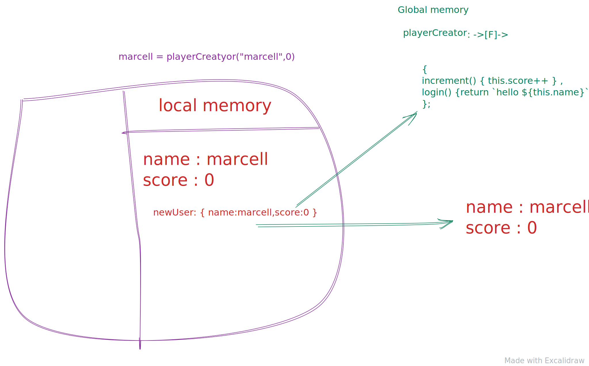

Classical `OOP` languages like `Java` or `C++` are called object oriented languages for a reason, but I would say from my point of view that they are class oriented languages and not object oriented.
`Javascript` is more a `Object oriented`. You don't have features in `Java` ore `C++` where you just can create a object just like that.

```js
const myObj = { name: "foo", isCool: true }
```

Just to make this in `Java` you would have to create a `class` for that.

in `Javascript` objects are linked to each other and we don't have inheritance in `JS` like in `Java`.

## Object create

`Object create` wil always give us a empty object back, what is does is that it will have some hidden properties. Those properties will be the object that you pass in as a argument.

```ts
interface Foo {
  name: string
  isCool: boolean
}
export const foo: Foo = {
  name: "bob",
  isCool: true,
}

const bar = Object.create(foo)

console.log(bar) // {}
console.log(foo) // {name:"bob", isCool: true}
console.log(bar.__proto__) // {name:"bob", isCool: true}
```




**Will Sentence from Front-end Masters**

> > JavaScript uses this proto link to give objects, functions and arrays a bunch of bonus functionality. All objects by
> > default have **proto**
