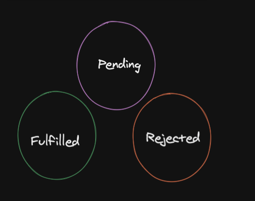

# Promises

A `promise` is something that we wait for in the feature it can either be `fulfilled` ,`pending` or `rejected`.

Building a mental model with metaphors.
Let's say you order a pair of shoes form some kind of e-store, we will get a promise that we will get the shoes sometimes in the future. We don't have to wait at home until it comes because we haver other stuff to do mean while the shoes store deliver your order.
The before state is when our promise is `pending`.

Same goes for our program in `JS` we don't want our promise to block rest of the code. We want to do other stuff meanwhile we will get our response back.

But something can go wrong and that case the promise will be `rejected`.
Remember that a promise can only have on state and could not be changed back to another. Once a promise is `rejected` it can't be `fulfilled` or the straight opposite.

#### using fetch

fetch is asynchronous operation and does not return our data directly what it's return is a `response-promise`

### Problems about promise

- a majority of developers have no idea how they working under the hood
- Debugging becomes way much harder as a result
- Developers fail technical interview's

### Benefits about promise

- Cleaner readable style of writing pseudo-synchronous style code
- Nice error handling process
