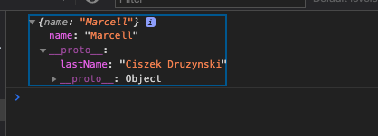
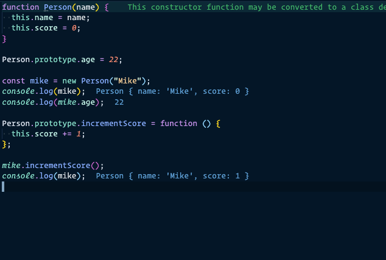
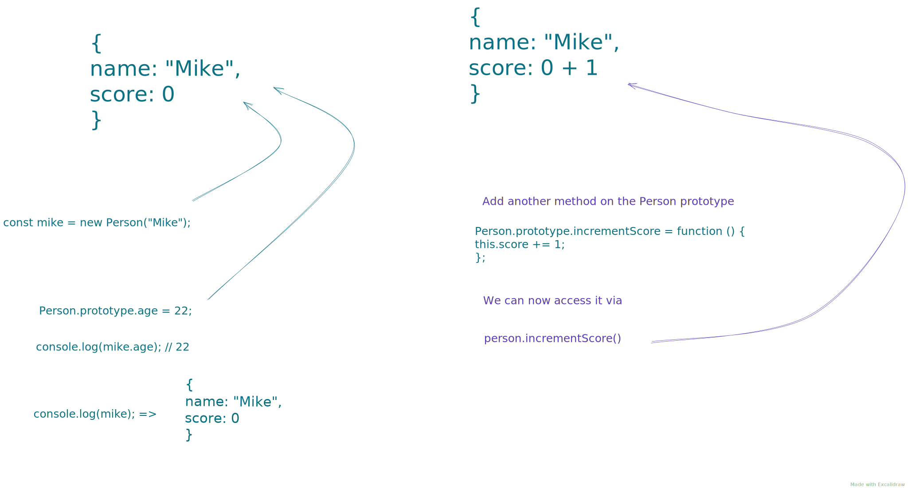
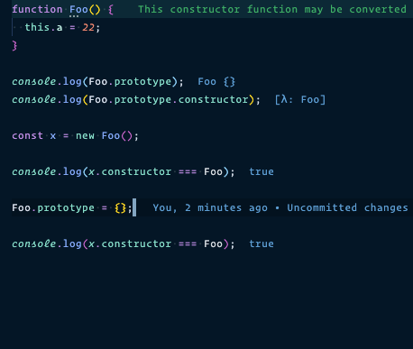
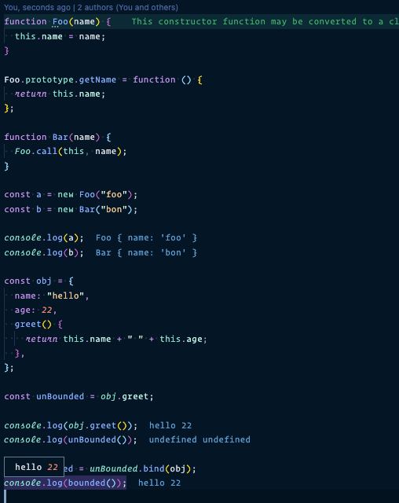

# Prototypal Inheritance

Objects in Javascript gives us the opportunity to create objects with keys and values pairs.
If you coming from a `Object oriented language` like `Java` you would have to use a class or a Hashmap.

In `JavaScript` we use Prototypal Inheritance to link objects to objects and find different relations between them.

```js
const person = {
  name: "Marcell",
};

const protoObj = {
  lastName: "Ciszek Druzynski",
};

Object.setPrototypeOf(person, protoObj);
console.log(person);
console.log(person.lastName); //Ciszek Druzynski
```



## The `new keyword`

When the new keyword is used on a function there a few steps that happens automatically.

- A brand new object is created out of thin air.
- The second is that it is `prototyped` Linked to the object. Adds a property to the new object.
- Binds the newly created object instance as the this context.
- Returns `this` if the function does not returns an object.




## Constructor pattern

When a function is declared they are automatically given a property that has a value of an object.



## This keyword


